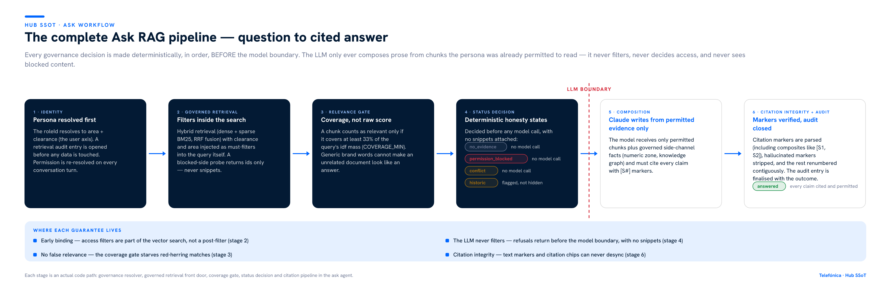
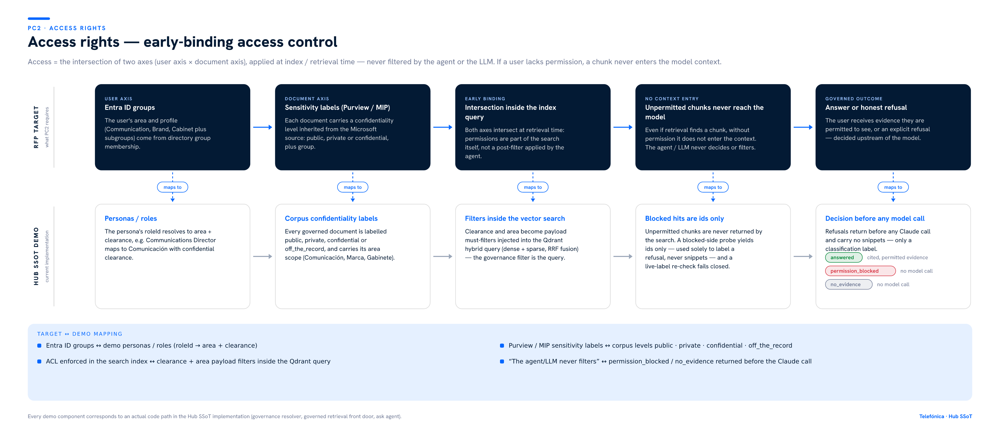
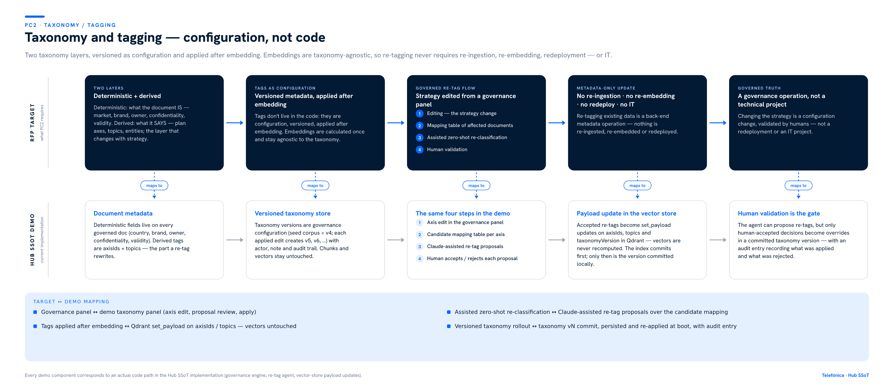
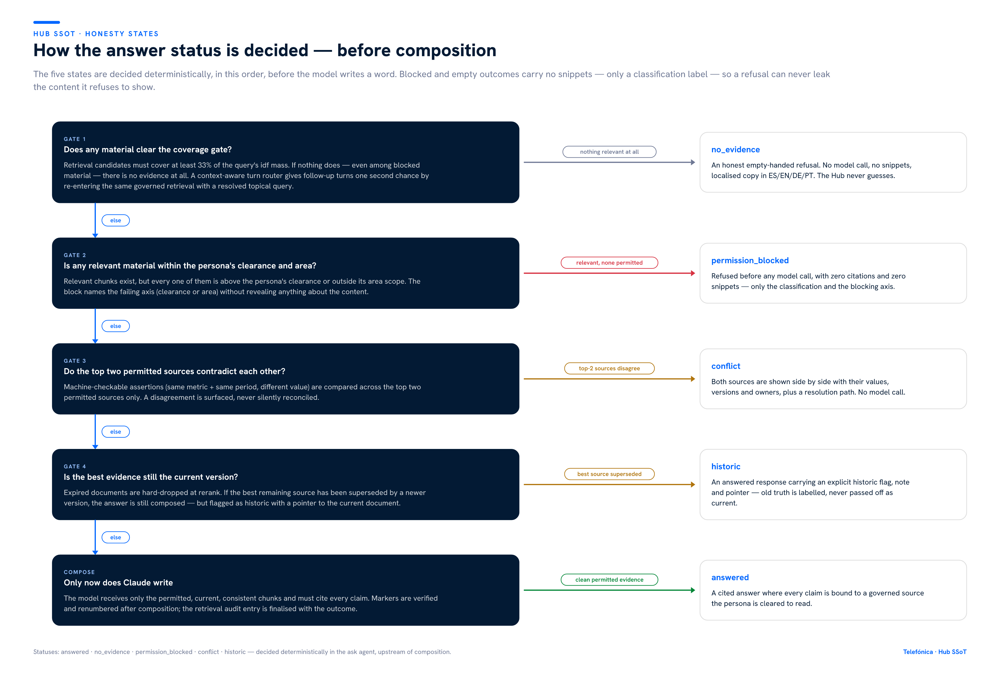
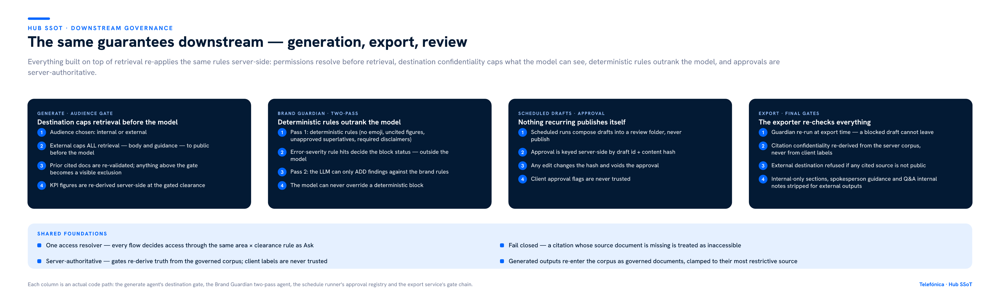
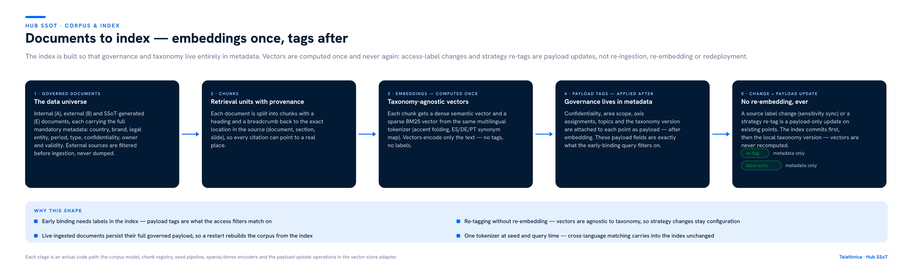

# Hub SSoT — How the Governed-RAG Problem Is Solved End to End

A single, governed, agentic Source of Truth for Telefónica's Communication & Brand teams. This document explains — grounded in the actual implementation — how Hub SSoT answers the central question of the PC2 / RFP synthesis: **how do you let an AI answer over a sensitive corpus without ever letting it leak, guess, or invent?**

The short answer, and the design principle behind every section that follows:

> **Governance decisions are made deterministically, before the model. The LLM only ever composes prose from evidence the user was already permitted to read. It never filters, never decides access, and never sees blocked content.**

---

## 1. The problem being solved

Telefónica's Communication, Brand and Cabinet teams sit on a corpus that mixes public press material with private briefings, confidential strategy and off-the-record board material. The RFP asks for a system where:

- People ask questions in natural language and get answers **always backed by cited evidence**.
- Access rights are the **intersection of two axes** — user (area/profile) × document (confidentiality label) — **applied at index/retrieval time (early binding), never by the agent**. If a user lacks permission, a chunk must never enter the model context.
- Taxonomy and tagging are **configuration, not code**: embeddings are computed once and stay agnostic to the taxonomy, so a strategy change re-tags existing data without re-ingestion, re-embedding, redeployment — or IT.
- When a confident, permitted answer is not possible, the system gives an **honest refusal** — "no evidence", "permission blocked", or "this source is historic" — rather than a plausible hallucination.

A conventional RAG pipeline fails all three: it filters (if at all) after retrieval, trusts the model to be discreet, re-embeds when metadata changes, and answers even when it should not. Hub SSoT is built so those failure modes are structurally impossible, not just discouraged by a prompt.

---

## 2. Architecture at a glance

The demo is a pnpm monorepo with a contract-first API:

- **Governed corpus** — a synthetic but fully governed Telefónica corpus: internal (A), external (B) and SSoT-generated (E) documents, each carrying country, brand, legal entity, period, type, confidentiality (`public` / `private` / `confidential` / `off_the_record`), owner, validity (`approved` / `historic` / `review` / `superseded`) and area scope (Comunicación, Marca, Gabinete). External sources carry a pre-ingest filter record (keywords, competitors, executives, topics, sentiment) — filtered before ingestion, never a raw dump.
- **Vector index — Qdrant Cloud** — a real managed Qdrant collection (`hub_ssot_chunks`) holding one point per chunk: a 384-dimension dense semantic vector (all-MiniLM-L6-v2, embedded server-side by Qdrant Cloud Inference at upsert) plus a sparse BM25 vector from one shared multilingual tokenizer, fused at query time with Reciprocal Rank Fusion. All governance labels are stored as point payload. Runtime-ingested documents persist their full governed payload, so a restart rebuilds the live corpus from the index.
- **One access resolver** — a single `area × clearance` intersection rule (`resolveDocAccess`) that every retrieval path, side channel, downstream flow and export gate must use. Clearance is checked first, then area scope.
- **Agents** — Ask (governed Q&A), Generate (governed content creation), Brand Guardian (two-pass review), KPI chat (governed figures), a schedule runner (recurring drafts with human approval) and an export service (final server-side gates). Composition uses Claude behind Lyzr-named adapter interfaces (`kb`, `kg`, `numeric`, `text`), so a real Lyzr backend can be swapped in without touching the agents or routes.
- **Audit** — every retrieval, on every surface, is logged with the persona, the filters applied, every hit and its access decision, and the final outcome.

Persona/clearance is client-asserted in this demo (a persona switcher, not real authentication); everything downstream of that assertion is enforced exactly as the target architecture requires.

---

## 3. The complete Ask RAG pipeline

A question travels through six ordered stages. The first four are deterministic code; the model appears only at stage five, and only when a permitted answer is possible.

**Stage 1 — Identity first.** The persona's `roleId` resolves to an area and a clearance level — the user axis. A retrieval audit entry is opened before any data is touched. Permissions are re-resolved on every conversation turn, and conversation memory is persona-scoped: history is filtered by the current role so a lower-clearance persona can never inherit a higher-clearance turn.

**Stage 2 — Governed retrieval.** The query runs against Qdrant as a hybrid search (dense + sparse, reciprocal-rank fusion) with the persona's clearance and area injected as **must-filters inside the query itself**. This is early binding as PC2 defines it: the governance filter *is* the search, not a post-filter applied by an agent. A separate blocked-side probe returns **ids only** — used solely to distinguish "nothing exists" from "something exists that you cannot see", never to fetch snippets — and a live-label re-check on those ids fails closed.

**Stage 3 — Relevance by coverage, not raw score.** A chunk only counts as relevant if it covers at least 33% of the query's idf mass (`COVERAGE_MIN`). This is a deliberate departure from absolute BM25 thresholds: generic brand words ("Telefónica") or stray verbs ("strategy") carry little idf mass, so they cannot make an unrelated public document look like an answer. The gate is what makes `no_evidence` trustworthy.

**Stage 4 — Deterministic status decision.** Before any model call, the pipeline decides the honesty state (section 6). `no_evidence` and `permission_blocked` return immediately, carrying **no snippets — only a classification label**. Conflicts between the top two permitted sources are surfaced, not reconciled. Superseded evidence flags the answer as historic.

**Stage 5 — Composition.** Only now does Claude see anything: the permitted chunks, plus governed side-channel facts (the numeric zone and the knowledge graph, both access-checked through the same resolver). The system rules require every claim to carry an `[S#]` citation marker and forbid outside knowledge.

**Stage 6 — Citation integrity and audit.** The response is parsed for citation markers — including composite markers like `[S1, S2]` — hallucinated or stray markers are stripped, and the survivors are renumbered contiguously so inline markers and citation chips can never desync. The audit entry is finalised with the outcome.

For follow-up turns that initially find nothing, a small router model classifies the intent; genuine topic questions get one second chance through the **same** governed retrieval with a context-resolved standalone query. The router changes the query, never the rules — and non-topical wording (chat phrasing, refine instructions) is never folded into the coverage-gated query, so it cannot dilute the relevance ratio.

---

## 4. Early-binding access control

This is the existing PC2 access-rights diagram; the solution described here is the demo lane of that diagram, unchanged.

PC2's rule: *access = intersection of two axes, applied at the index/retrieval (early-binding), never by the agent.* The mapping in the implementation:

| PC2 target | Hub SSoT implementation |
| --- | --- |
| User axis from Entra ID groups | Persona `roleId` → area + clearance via the governance resolver |
| Document axis from Purview/MIP sensitivity labels | Corpus confidentiality labels `public` / `private` / `confidential` / `off_the_record` + area scope |
| Intersection inside the index query | Clearance + area payload must-filters inside the hybrid vector search |
| Unpermitted chunks never reach the model | Blocked-side probe yields ids only; refusals return before the Claude call with no snippets |

Three properties make this early binding real rather than nominal:

1. **The filter is part of the search.** There is no code path where an unpermitted chunk is retrieved and then discarded by agent logic — the index never returns it.
2. **One resolver, no side doors.** Numeric facts, knowledge-graph traversal, KPI figures and export citation checks all resolve access through the same `area × clearance` rule. (An earlier iteration had a rank-only check on one side channel; it was found and closed — the lesson is codified: every side channel gates through the shared resolver.)
3. **Fail closed.** A numeric fact whose source document is missing is treated as inaccessible. A blocked-probe id whose live label cannot be re-verified is treated as blocked.

---

## 5. Taxonomy and tagging as configuration

This is the existing PC2 taxonomy diagram; again, the demo lane is exactly what is implemented.

PC2's anchor: *"changing the strategy = a governance operation, not a technical project."* The taxonomy has two layers — deterministic (what the document **is**: market, brand, owner, confidentiality, validity) and derived (what it **says**: plan axes, topics — the layer that changes with strategy). The derived layer is versioned configuration, never code:

- The seed corpus ships classified against taxonomy **v4**; every applied edit creates v5, v6, … with actor, note and audit trail, persisted and re-applied at boot.
- The governed re-tag flow is the same four steps PC2 specifies: **axis edit** in the governance panel → **candidate mapping table** of affected documents → **assisted zero-shot re-classification** (Claude proposes) → **human validation** (a person accepts or rejects each proposal). Only human-accepted decisions become overrides in a committed version.
- Applying a version mutates **metadata only** — axis labels, `axisIds`, `topics` — as payload updates on existing index points. Chunks, embeddings and the retrieval index are untouched: no re-ingestion, no re-embedding, no redeploy, no IT.
- The index commits first; only then is the version committed locally — so the vector store and the taxonomy version can never disagree in the dangerous direction.

---

## 6. The honesty states

Where most RAG systems have one output (an answer), Hub SSoT has five, decided in a strict order **before composition**:

| Status | Meaning | Model called? | Snippets attached? |
| --- | --- | --- | --- |
| `no_evidence` | Nothing in the governed corpus covers the question | No | None |
| `permission_blocked` | Relevant material exists; none of it is within the persona's clearance/area | No | None — only the blocking axis |
| `conflict` | The top two permitted sources disagree on the same metric and period | No | Both sources, side by side |
| `historic` | Answered, but the best source has been superseded | Yes | Flagged, with a pointer to the current document |
| `answered` | Cited answer from permitted, current, consistent evidence | Yes | Every claim cited |

Two details matter for trust:

- **Refusals cannot leak.** A `permission_blocked` response carries zero snippets and zero citations — it names the failing axis (clearance or area), nothing else. The refusal also carries a machine-readable code, so the frontend keys its remediation UX ("switch persona", "request access") on the code rather than parsing prose.
- **Conflicts are surfaced, never merged.** Conflict detection compares machine-checkable assertions (same metric + same period, different value) across the top two permitted sources only — retrieval noise further down the ranking cannot fabricate a conflict, and corroboration ("n sources agree") counts distinct cited documents, not retrieved chunks.

---

## 7. Downstream flows inherit the same guarantees

Answering questions is only half the product; the other half is generating governed content. Every downstream flow re-applies the same principles server-side.

**Generate — the audience gate.** When a draft's audience is *external*, the effective clearance for **all** retrieval — body sources *and* internal guidance material — is capped to `public` **before** the model runs. Retrieval still runs at the persona's real clearance in parallel, but only to explain what was excluded: anything above the gate appears as a visible exclusion, never as content. KPI figures referenced in a brief are re-derived server-side at the gated clearance, not copied from the client.

**Brand Guardian — two passes, deterministic rules win.** Pass one is deterministic: hard rules (no emoji, uncited figures, unapproved superlatives, required disclaimers) scan the text, and any error-severity hit decides the `block` status — outside the model. Pass two asks Claude to review against the brand rulebook, but the model can only **add** findings; it can never override a deterministic block. Quotes from the model are mapped back to exact text spans deterministically.

**Scheduled drafts — server-authoritative approval.** Recurring runs compose drafts into a review folder; nothing recurring publishes itself. Approval is registered server-side, keyed by **draft id + content hash** — any edit to an approved draft changes the hash and silently voids the approval. Client-side approval flags are never trusted.

**Export — the final gate chain.** The exporter re-checks everything at the moment of export: the Guardian is re-run (a blocked draft cannot leave), scheduled approval is re-verified against the hash registry, press releases require an editorial-review record, and the destination gate **re-derives the confidentiality of every citation from the server corpus** — never from labels the client sent. An external export with any non-public cited source is refused with `confidentiality_blocked`. Internal-only sections, spokesperson guidance and Q&A internal notes are stripped from external outputs on the server.

Finally, generated outputs re-enter the corpus as governed **E-category documents** with lineage back to their sources, clamped to the most restrictive confidentiality among them — so the SSoT's own outputs are governed by the same rules that produced them.

---

## 8. Corpus and indexing — embeddings once, tags after

The index is shaped by one requirement: governance and taxonomy must live entirely in metadata.

1. **Governed documents** carry the full mandatory metadata (section 2). External (B) documents additionally record what the pre-ingest filter matched.
2. **Chunks** carry a heading and a breadcrumb back to the exact location in the source (document › section › slide), so every citation points to a real place a human can verify.
3. **Embeddings are computed once.** Each chunk gets a dense semantic vector (all-MiniLM-L6-v2, computed by Qdrant Cloud Inference at upsert) and a sparse BM25 vector from the same multilingual tokenizer (accent folding first, then a curated EN/ES/DE/PT synonym map). The vectors encode only the text — no tags, no labels.
4. **Payload tags are applied after embedding**: confidentiality, area scope, `axisIds`, topics, validity and the taxonomy version. These payload fields are exactly what the early-binding query filters match on.
5. **Every subsequent change is a payload update.** A sensitivity-label change or a strategy re-tag is `set_payload` on existing points; vectors are never recomputed. Live-ingested documents persist their full governed payload in the index, so a restart hydrates the corpus from it.

This is the structural reason the taxonomy promise holds: because the vectors never encoded the taxonomy in the first place, there is nothing to re-embed when the taxonomy changes.

---

## 9. Auditability

Every text retrieval, on every surface that retrieves text (Ask, Generate, the live draft editor), writes an audit entry containing the surface, persona (`roleId`, label, clearance, area), the query, the engine that served it (`qdrant`), the exact filter expression applied, every hit with its score and access decision, and the final status. KPI chat performs no text retrieval — it reads the governed numeric zone, access-checked through the same shared resolver. Entries are persisted to disk with a debounced writer and are queryable by document or persona — so a governance owner can answer both "who retrieved this document?" and "what did this persona see?" after the fact. The entry is opened **before** retrieval and finalised with the outcome, so even refused turns leave a trace.

---

## 10. What is real and what is faithfully simulated

The demo is honest about its own boundaries:

| Real, working code | Faithfully simulated |
| --- | --- |
| Early-binding filters inside the hybrid vector search | Entra ID group membership (demo personas assert the role) |
| The full honesty-state decision pipeline, pre-model | Purview/MIP label inheritance (labels are seeded on the corpus) |
| Versioned taxonomy with human-validated re-tagging, payload-only | Source connectors (SharePoint sync, API feeds are labelled provenance) |
| Claude composition with citation verification and renumbering | The corpus content itself (synthetic, clearly marked fictional) |
| Guardian two-pass, schedule approval registry, export gate chain | Lyzr platform (real Qdrant Cloud + Claude sit behind Lyzr-named adapter interfaces) |
| Hybrid retrieval on a managed Qdrant Cloud collection — dense + sparse vectors, RRF fusion, governance filters inside the query | Source connectors' binary parsing (documents arrive pre-extracted) |
| Retrieval audit log with per-hit access decisions | Real authentication (persona switching is client-asserted) |

The swap path is explicit: identity plugs in at the single access resolver, real sensitivity labels plug in at the document metadata, and a real Lyzr backend plugs in behind the existing `kb` / `kg` / `numeric` adapter interfaces — none of which requires touching the agents, the gates or the routes.

---

## 11. Live verification — measured on the running system (15 July 2026)

Everything below was measured against the live Qdrant Cloud collection and the running API server on the date above — none of it is asserted from code reading alone.

**The collection is real, healthy and complete.**

| Measured | Value |
| --- | --- |
| Collection | `hub_ssot_chunks`, status `green` |
| Points | 1,279 — exactly 1,274 seed-corpus chunks + 5 chunks from 3 live-ingested documents |
| Indexed vectors | 1,279 (dense 384-dim cosine + sparse BM25 per point) |
| By category | A (internal) 687 · B (external) 387 · E (SSoT-generated) 205 |
| By confidentiality | public 403 · private 525 · confidential 333 · off_the_record 18 |

Every breakdown sums to the total and matches the in-memory governed corpus, count for count — ingestion parity is exact.

**Every surface retrieves through the same governed front door.** The retrieval audit log records, for each event, the engine that served it. Live entries captured after real requests:

- Ask, press persona (public clearance): `engine: qdrant`, filter `confidentiality<=public; area in {Comunicación, cross-area}` — answered from public results documents; two over-clearance talking-points documents appear in the log as **blocked, ids only**.
- Ask, super-user persona: `engine: qdrant`, filter `confidentiality<=off_the_record`.
- Generate, director persona, external audience: two passes in one entry — body at `confidentiality<=confidential`, guidance capped to `confidentiality<=public` by the audience gate — both `engine: qdrant`.

**Re-tagging provably never re-embeds.** Applying a taxonomy version returns a machine-checkable proof object: point counts before and after (unchanged), and dense-vector content hashes for sampled changed documents before and after the `set_payload` operation (identical), alongside the payload fields that did change.

**Found and fixed during this verification.** An honest audit reports its own findings:

1. The index had been seeded before the corpus was last expanded — it held 218 points against 1,279 corpus chunks, so hybrid retrieval was silently running over 17% of the knowledge base. The idempotent seeder was re-run; parity is now exact (and the seeder replays applied source-sync label deltas, so post-delta governance labels were preserved).
2. The Generate agent, the live draft editor and Ask's follow-up retrieve tool were still calling the local BM25 engine directly instead of the governed Qdrant front door. Governance filtering was identical on both paths (same shared resolver), so this was never a leak — but those surfaces were not hybrid retrieval. All retrieval call sites now go through the single governed entry point, verified live: every new audit event on every surface reports `engine: qdrant`.

The native BM25 engine remains in the codebase for exactly one purpose: an explicit dev-mode fallback when Qdrant credentials are not configured, labelled as such in the audit log (`engine: native`). When Qdrant is configured there is no silent fallback — a Qdrant failure surfaces as an error, never as quietly degraded retrieval.

---

## Appendix

- **[RAG coverage matrix](./RAG_COVERAGE.md)** — the detailed requirement-by-requirement mapping of PC2 / RFP synthesis items to implementation status, kept alongside this document.
- **Reference diagrams** — the two PC2 requirement diagrams embedded in sections 4 and 5 live in `exports/diagrams/` (`access-rights-early-binding`, `taxonomy-as-configuration`), together with the four workflow diagrams introduced by this document (`ask-rag-pipeline`, `honesty-states-decision`, `downstream-governed-flows`, `corpus-indexing-pipeline`), each available as SVG and PNG.
